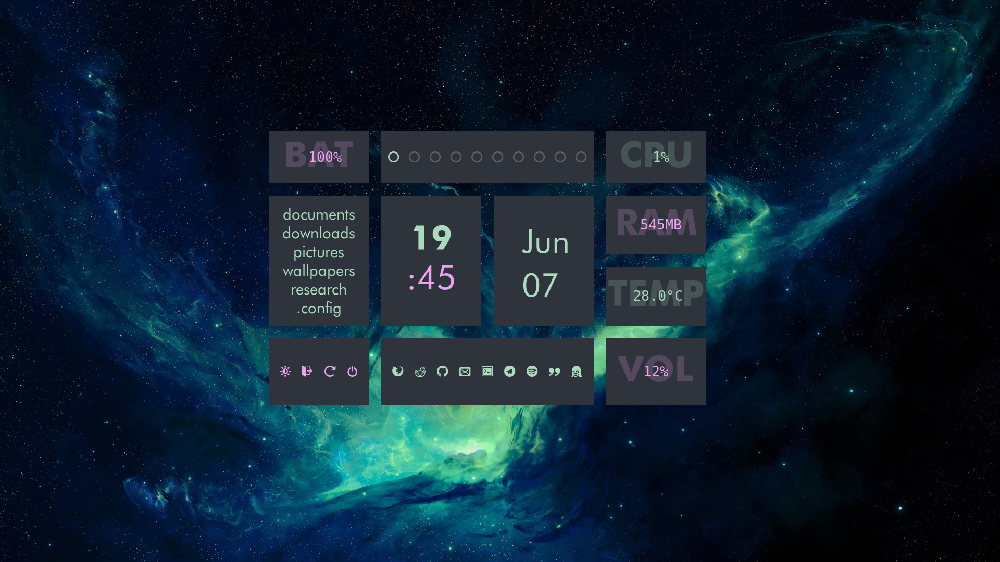
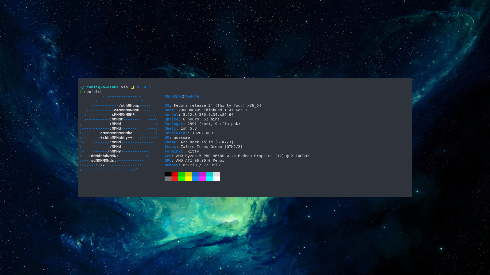

# dotfiles

This is my AwesomeWM setup running on the stable branch. The whole desktop is built to be minimal, with a pop-up dashboard containing all the time and system information, along with a hub for hotkeys.

Rofi is used as the launcher (with a matching colorscheme), though there are hotkeys for most frequently used programs. Kitty is the default terminal and a config with a matching colorscheme is included in the dots. My neovim config has some options tweaked and uses the [Quantum](https://github.com/tyrannicaltoucan/vim-quantum) vim airine and colorscheme.

There are light and dark colorschemes.

This widgets are originally adapted from [Awesome Copycats](https://github.com/lcpz/awesome-copycats).

## Dependencies

- light

- rofi

- redshift

## Fonts

- [Icomoon](https://icomoon.io/)
	- Taglist and application icons 
- [Hack](https://www.dafont.com/hack.font)
	- System information in the dashboard.
- [Futura](https://fonts.adobe.com/fonts/futura-pt)
	- General system font