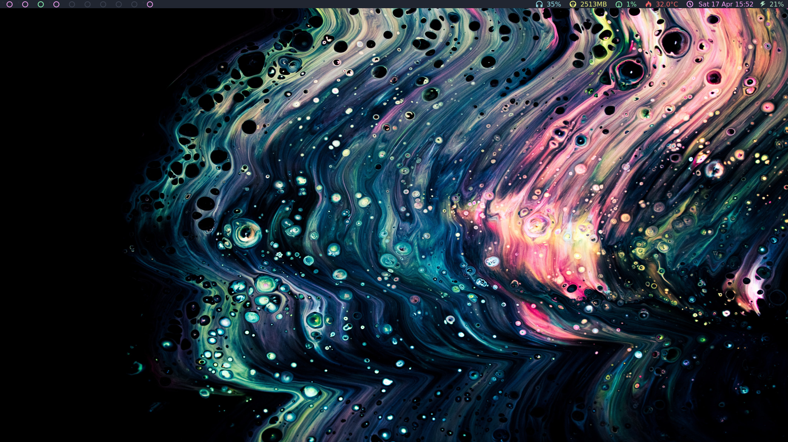

# dotfiles
My personal AwesomeWM Config

This is my pretty simple Awesome setup, very minimal as far as features but I have all the essential stuff in the top bar. Rofi is used as the launcher (with a matching colorscheme), though there are hotkeys for most frequently used programs.

The colorscheme is an original one that I call "ethereal." It's solid, but not super pleasant to look at, so another one is in the works :)

## Dependencies

- light

- rofi

- redshift

## Fonts

I use [Icomoon](https://icomoon.io/) for the top bar icons and [Microns](https://www.s-ings.com/projects/microns-icon-font/) for the taglist (workspaces list/desktop list/whatever!) dots. Then [Futura](https://fonts.adobe.com/fonts/futura-pt) is set in theme.lua to be a general system font.
